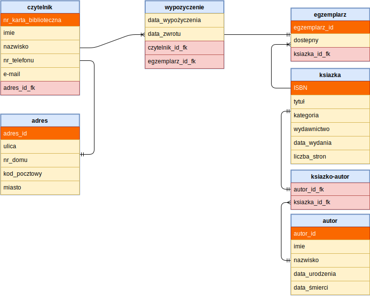

# Biblioteka
Projekt bazy danych biblioteki umożliwiający rejestrację czytelników, dodawanie zbiorów i wypożyczeń oraz zarządzanie tymi danymi.

| Nazwisko i imię  | Wydział | Kierunek | Semestr | Grupa | Rok akademicki |
| :--------------: | :-----: | :------: | :-----: | :---: | :------------: |
| Błoniarz Patryk  | WIMiIP  | IS       |    4    |   4   | 2019/2020      |
| Zieja Bartłomiej | WIMiIP  | IS       |    4    |   4   | 2019/2020      |

## Projekt bazy danych


Przykładowe zapytania tworzące tabele:
```mysql
CREATE TABLE `adres` (
  `adres_id` int(11) NOT NULL,
  `ulica` varchar(30) COLLATE utf8mb4_polish_ci NOT NULL,
  `nr_domu` int(11) NOT NULL,
  `kod_pocztowy` int(11) NOT NULL,
  `miasto` varchar(30) COLLATE utf8mb4_polish_ci NOT NULL
) ENGINE=InnoDB DEFAULT CHARSET=utf8mb4 COLLATE=utf8mb4_polish_ci;


CREATE TABLE `czytelnik` (
  `nr_karta_biblioteczna` int(11) NOT NULL,
  `imie` varchar(30) COLLATE utf8mb4_polish_ci NOT NULL,
  `nazwisko` varchar(30) COLLATE utf8mb4_polish_ci NOT NULL,
  `nr_telefonu` int(20) NOT NULL,
  `e_mail` varchar(30) COLLATE utf8mb4_polish_ci NOT NULL,
  `adres_id_fk` int(11) NOT NULL
) ENGINE=InnoDB DEFAULT CHARSET=utf8mb4 COLLATE=utf8mb4_polish_ci;
```

## Implementacja zapytań SQL
Funkcjonalności bazy danych:

1. Dodawanie nowego czytelnika wraz z adresem. Z uwagi na budowę bazy najpierw dodawany jest adres użytkownika, a potem jego klucz główny (tabeli adres) jest przekazywany do zapytania tworzącego użytkownika.
```mysql
INSERT INTO adres( ulica, nr_domu, kod_pocztowy, miasto) VALUES ('ULICA', NR_DOMU, KOD_POCZTOWY, 'MIASTO')
INSERT INTO czytelnik( imie, nazwisko, nr_telefonu, e_mail, adres_id_fk) VALUES ('Jan', 'Kowalski', 123456789, 'jkowalski@gmail.com', (SELECT MAX(adres_id) FROM adres));
```

2. Edycja danych czytelnika i jego adresu na podstawie numeru karty bibliotecznej.
```mysql
UPDATE czytelnik, adres
SET imie = 'INPUT_IMIE', nazwisko = 'INPUT_NAZWISKO', nr_telefonu = INPUT_TELEFON, e_mail = 'INPUT_MAIL', adres.ulica = 'INPUT_ULICA', adres.nr_domu = INPUT_NR_DOMU, adres.kod_pocztowy = KOD_POCZTOWY, adres.miasto = 'MIASTO'
WHERE czytelnik.adres_id_fk = adres.adres_id AND czytelnik.nr_karta_biblioteczna = nr_karty
```

3. Sprawdzenie ile wypożczeń jest przypisanych do konta czytelnika.
```mysql
SELECT COUNT(wypozyczenie.egzemplarz_id_fk) 
FROM wypozyczenie 
INNER JOIN czytelnik
ON wypozyczenie.czytelnk_id_fk = czytelnik.nr_karta_biblioteczna 
WHERE czytelnik.nr_karta_biblioteczna
```

4. Usuwanie czytelnika i związanego z nim adresu.
```mysql
DELETE czytelnik, adres 
FROM czytelnik 
INNER JOIN adres 
ON czytelnik.adres_id_fk = adres.adres_id
WHERE czytelnik.nr_karta_biblioteczna = NR_KARTY
```
5. Dodawanie książki do bazy.
```mysql
INSERT INTO ksiazka(ISBN, tytul, kategoria, wydawnictwo, data_wydania, liczba_stron)
VALUES (INPUT_ISBN, 'INPUT_TYTUL', 'INPUT_KATEGORIA', 'INPUT_WYDAWNICTWO', INPUT_DATA_WYDANIA, INPUT_LICZBA_STRON)
```

6. Dodawanie autora do bazy.
```mysql
INSERT INTO autor(imie, nazwisko, data_urodzenia, data_smierci)
VALUES ('INPUT_IMIE', 'INPUT_NAZWISKO', INPUT_DATA_URODZENIA, INPUT_DATA_SMIERCI)
```

7. Dodawanie fizycznych egzemplarzy książek (które będzie można wypożyczać).
```mysql
INSERT INTO egzemplarz(ksiazka_id_fk, dostepny) 
VALUES(INPUT_ID_KSIAZKI, true)
```

8. Sprawdzanie dostępności wolnych egzemplarzy danej książki poprzez wybranie najmniejszego id wolnego egzemplarza (jeśli istnieje wolny egzemplarz).
```mysql
SELECT egzemplarz.egzemplarz_id FROM egzemplarz 
INNER JOIN ksiazka
ON egzemplarz.ksiazka_id_fk = ksiazka.ISBN 
WHERE egzemplarz.dostepny = true AND ksiazka.ISBN = tytul_id
ORDER BY egzemplarz.egzemplarz_id
LIMIT 1
```

9. Wypożyczanie egzemplarza książki przez czytelnika.
```mysql
INSERT INTO wypozyczenie(data_wypozyczenia, data_zwrotu, czytelnk_id_fk, egzemplarz_id_fk)
VALUES(DATA_WYPOZYCZENIA, DATA_ODDANIA, ID_CZYTELNIKA, ID_EGZEMPLARZ);

UPDATE egzemplarz SET dostepny = false 
WHERE egzemplarz.egzemplarz_id =ID_EGZEMPLARZ;
```

10. Sprawdzawdzanie wszystkich wypozyczeń lub ich wyszukiwanie po nazwisku lub numerze karty bibliotecznej czytelnika albo tytule wypożyczonej książki. 
```mysql
SELECT czytelnik.nr_karta_biblioteczna as 'Numer Karty Bibliotecznej', czytelnik.imie as 'Imie', czytelnik.nazwisko as 'Nazwisko', ksiazka.tytul as 'Tytuł', egzemplarz.egzemplarz_id, wypozyczenie.data_wypozyczenia as 'Data wypożyczenia', wypozyczenie.data_zwrotu as 'Data zwrotu'
FROM wypozyczenie 
INNER JOIN czytelnik 
ON czytelnik.nr_karta_biblioteczna = wypozyczenie.czytelnk_id_fk
INNER JOIN egzemplarz 
ON egzemplarz.egzemplarz_id = wypozyczenie.egzemplarz_id_fk
INNER JOIN ksiazka 
ON ksiazka.ISBN = egzemplarz.ksiazka_id_fk
WHERE czytelnik.nazwisko LIKE "%%" AND ksiazka.tytul LIKE "%%" AND czytelnik.nr_karta_biblioteczna = NR_KARTY_BIBLIOTECZNEJ
```

11. Sprawdzanie wszystkich przetrzymań lub ich wyszukiwanie po nazwisku lub numerze karty bibliotecznej czytelnika albo tytule wypożyczonej książki.
```mysql
SELECT czytelnik.nr_karta_biblioteczna as 'Numer Karty Bibliotecznej', czytelnik.imie as 'Imie', czytelnik.nazwisko as 'Nazwisko', ksiazka.tytul as 'Tytuł', egzemplarz.egzemplarz_id, wypozyczenie.data_wypozyczenia as 'Data wypożyczenia', wypozyczenie.data_zwrotu as 'Data zwrotu'
FROM wypozyczenie 
INNER JOIN czytelnik 
ON czytelnik.nr_karta_biblioteczna = wypozyczenie.czytelnk_id_fk
INNER JOIN egzemplarz 
ON egzemplarz.egzemplarz_id = wypozyczenie.egzemplarz_id_fk
INNER JOIN ksiazka 
ON ksiazka.ISBN = egzemplarz.ksiazka_id_fk
WHERE czytelnik.nazwisko LIKE "%%" AND ksiazka.tytul LIKE "%%" AND czytelnik.nr_karta_biblioteczna = NR_KARTY_BIBLIOTECZNEJ AND CURDATE() > wypozyczenie.data_zwrotu
```

12. Zwrot wypożyczonych książek.
```mysql
DELETE FROM wypozyczenie
WHERE wypozyczenie.czytelnk_id_fk = ID_CZYTELNIKA AND wypozyczenie.egzemplarz_id_fk = ID_EGZEMPLARZ;

UPDATE egzemplarz SET dostepny = true WHERE egzemplarz.egzemplarz_id = ID_EGZEMPLARZ;
```

13. Przeszukiwanie listy czytelników względem imienia lub nazwiska lub numeru karty blibliotecznej w porządku alfabetycznym wg nazwisk.
```mysql
SELECT czytelnik.nazwisko as 'Nazwisko', czytelnik.imie as 'Imie' czytelnik.nr_karta_biblioteczna as 'Numer Karty Bibliotecznej', czytelnik.nr_telefonu as 'Numer telefonu', czytelnik.e_mail as 'e-mail' , adres.ulica as 'Ulica', adres.nr_domu as 'Numer domu', adres.kod_pocztowy as 'Kod pocztowy', adres.miasto as 'Miasto', czytelnik.adres_id_fk 
FROM czytelnik
INNER JOIN adres 
ON czytelnik.adres_id_fk = adres.adres_id
WHERE czytelnik.nazwisko LIKE "%%" AND czytelnik.imie LIKE "%%" AND czytelnik.nr_karta_biblioteczna = NR_KARTY_BIBLIOTECZNEJ
ORDER BY czytelnik.nazwisko;
```

14. Przeszukiwanie listy książek po ich tytule lub kategorii lub nazwisku autora. Lista zawiera dodatkowo informacje o liczbie dostępnych wolnych egzemplarzy danej ksiązki.
```mysql
SELECT ksiazka.tytul as 'Tytuł', autor.nazwisko as 'Nazwisko', autor.imie as 'Imie', ksiazka.kategoria as 'Kategoria', ksiazka.wydawnictwo as 'Wydawnictwo', ksiazka.ISBN as 'Numer ISBN', ksiazka.data_wydania as 'Data wydania', ksiazka.liczba_stron as 'Liczba stron', COUNT(egzemplarz.egzemplarz_id) as 'Ilość dostępnych egzemplarzy' 
FROM ksiazka 
INNER JOIN ksiazko_autor 
ON ksiazka.ISBN = ksiazko_autor.ksiazka_id_fk
INNER JOIN autor 
ON autor.autor_id = ksiazko_autor.autor_id_fk
LEFT JOIN egzemplarz 
ON egzemplarz.ksiazka_id_fk = ksiazka.ISBN AND egzemplarz.dostepny = true
WHERE ksiazka.tytul LIKE "%%" AND autor.nazwisko LIKE "%%" AND ksiazka.kategoria LIKE "%%" 
GROUP BY ksiazka.ISBN"
```

## Aplikacja
Aplikacja została napisana w języku C# z wykorzystaniem Windows Forms w programie Visual Studio z doinstalowanym MySQL .NET Connector Extension. Konektor umożliwia połączenie aplikacji z bazą danych uruchomioną w programie XAMPP. Aplikacja posiada klasę SQL_CONNECT, która zawiera w sobie właściwość connectionString odpowiadającą za nawiązywanie połączenia z bazą. Dzięki temu w przypadku przeniesienia bazy danych na inny serwer konieczna jest zmiana jedynie w ww. właściwości.
Aplikacja w obecnym stanie nie posiada możliwości logowania do bazy danych - użytkownik jest domyślnie zalogowany jako root.

Przykład użycia klasy SQL_CONNECT w aplikacji:
```csharp
class SQL_CONNECT
    {
        const string connectionString = "datasource=127.0.0.1;port=3306;username=root;password=;database=biblioteka_bloniarz_zieja";

        public MySqlConnection conneciton = new MySqlConnection(connectionString);
    }
```
Przykładowa implementacja zapytań w aplikacji:

- Wypożyczenie egzemplarza książki czytelnikowi:
```csharp
    private void BUT_WYPOZYCZ_Click(object sender, EventArgs e)
        {
            string zapytanie_id_egzemplarz = "SELECT egzemplarz.egzemplarz_id FROM egzemplarz INNER JOIN ksiazka " +
                "ON egzemplarz.ksiazka_id_fk = ksiazka.ISBN WHERE egzemplarz.dostepny = true AND ksiazka.ISBN = " +
                tytul_id + " ORDER BY egzemplarz.egzemplarz_id LIMIT 1";

            SQL_CONNECT polaczenie = new SQL_CONNECT();
            polaczenie.conneciton.Open();

            MySqlDataAdapter zlap_id_egzemplarz = new MySqlDataAdapter(zapytanie_id_egzemplarz, polaczenie.conneciton);
            
            DataSet zlap_egzemplarz = new DataSet();

            int czy_sa_wolne = zlap_id_egzemplarz.Fill(zlap_egzemplarz);

            polaczenie.conneciton.Close();

            if (czy_sa_wolne > 0)
            {
                string egzemplarz_ID = zlap_egzemplarz.Tables[0].Rows[0]["egzemplarz_id"].ToString();

                DateTime zlap_date = DateTime.Now;
                DateTime oddaj_data;
                oddaj_data = zlap_date.AddMonths(1);

                string miesiac_zwrotu, dzien_zwrotu, miesiac_wyporzyczenia, dzien_wyporzyczenia;

                if (oddaj_data.Month < 10) miesiac_zwrotu = "0" + oddaj_data.Month.ToString();
                else miesiac_zwrotu = oddaj_data.Month.ToString();
                if (oddaj_data.Day < 10) dzien_zwrotu = "0" + oddaj_data.Day.ToString();
                else dzien_zwrotu = oddaj_data.Day.ToString();

                if (zlap_date.Month < 10) miesiac_wyporzyczenia = "0" + zlap_date.Month.ToString();
                else miesiac_wyporzyczenia = zlap_date.Month.ToString();
                if (zlap_date.Day < 10) dzien_wyporzyczenia = "0" + zlap_date.Day.ToString();
                else dzien_wyporzyczenia = zlap_date.Day.ToString();

                string zapytanie_wyporzyczenie = "INSERT INTO `wypozyczenie`(`data_wypozyczenia`, `data_zwrotu`, `czytelnk_id_fk`, `egzemplarz_id_fk`) " +
                    " VALUES(" + zlap_date.Year.ToString() + miesiac_wyporzyczenia + dzien_wyporzyczenia + ","
                    + oddaj_data.Year.ToString() + miesiac_zwrotu + dzien_zwrotu + "," + czytelnik_id + "," + egzemplarz_ID + ");" +
                    " UPDATE `egzemplarz` SET `dostepny` = false WHERE egzemplarz.egzemplarz_id = " + egzemplarz_ID + ";";

                MySqlCommand dodaj_wypozyczenie = new MySqlCommand(zapytanie_wyporzyczenie, polaczenie.conneciton);
                dodaj_wypozyczenie.CommandTimeout = 60;

                try
                {
                    polaczenie.conneciton.Open();
                    MySqlDataReader myReader = dodaj_wypozyczenie.ExecuteReader();
                    polaczenie.conneciton.Close();

                    MessageBox.Show("Dodano wypożyczenie", "Powiadomienie");

                }
                catch (Exception ex)
                {
                    MessageBox.Show(ex.Message, "ERROR");
                }
            }
            else MessageBox.Show("Przepraszamy nie posiadamy już egzemplarzy danej książki", "Przepraszamy");

        }
```
- Wyszukiwanie książek na podstawie tytułu lub/i nazwiska autora lub/i kategorii (w przypadku nieokreślenia żadnego z tych kryteriów zostaną wypisane wszystkie książki z bazy):
```csharp
private void Wyszukaj_ksiazke_Load(object sender, EventArgs e)
        {
            string tytul;
            string nazwisko;
            string kategoria;

            if (INPUT_TYTUL.Text == "") tytul = "'%%'";
            else tytul = "'%" + INPUT_TYTUL.Text + "%'";

            if (INPUT_NAZWISKO.Text == "") nazwisko = "'%%'";
            else nazwisko = "'" + INPUT_NAZWISKO.Text + "'";

            if (INPUT_KATEGORIA.Text == "") kategoria = "'%%'";
            else kategoria = "'" + INPUT_KATEGORIA.Text + "'";

            string zapytanie_ksiazka = "SELECT ksiazka.tytul as 'Tytuł', autor.nazwisko as 'Nazwisko', autor.imie as 'Imie', ksiazka.kategoria as 'Kategoria', " +
                "ksiazka.wydawnictwo as 'Wydawnictwo', " + "ksiazka.ISBN as 'Numer ISBN', " +
                "ksiazka.data_wydania as 'Data wydania', ksiazka.liczba_stron as 'Liczba stron', COUNT(egzemplarz.egzemplarz_id) as 'Ilość dostępnych egzemplarzy'" +
                " FROM ksiazka INNER JOIN ksiazko_autor ON ksiazka.ISBN = ksiazko_autor.ksiazka_id_fk" +
                " INNER JOIN autor ON autor.autor_id = ksiazko_autor.autor_id_fk" +
                " LEFT JOIN egzemplarz ON egzemplarz.ksiazka_id_fk = ksiazka.ISBN AND egzemplarz.dostepny = true" +
                " WHERE ksiazka.tytul LIKE " + tytul + " AND autor.nazwisko LIKE " + nazwisko + " AND ksiazka.kategoria LIKE " + kategoria +
                " GROUP BY ksiazka.ISBN";

            SQL_CONNECT polaczenie = new SQL_CONNECT();

            polaczenie.conneciton.Open();

            MySqlDataAdapter pobierz_ksiazki = new MySqlDataAdapter(zapytanie_ksiazka, polaczenie.conneciton);

            DataTable lista = new DataTable();

            pobierz_ksiazki.Fill(lista);

            polaczenie.conneciton.Close();

            DATA_KSIAZKI.DataSource = lista;

            INPUT_TYTUL.Text = "";
            INPUT_NAZWISKO.Text = "";

            INPUT_KATEGORIA.ResetText();
            INPUT_KATEGORIA.SelectedIndex = -1;

            BUT_WYPOZYCZ.Enabled = false;
            BUT_DODAJ_EGZ.Enabled = false;
        }
```


## Dodatkowe uwagi
- Baza została stworzona przy pomocy phpMyAdmin.
- W celu poprawnego działania aplikacji należy zainstalować program XAMPP i zaimportować bazę danych z folderu /src/sql do phpMyAdmin.
