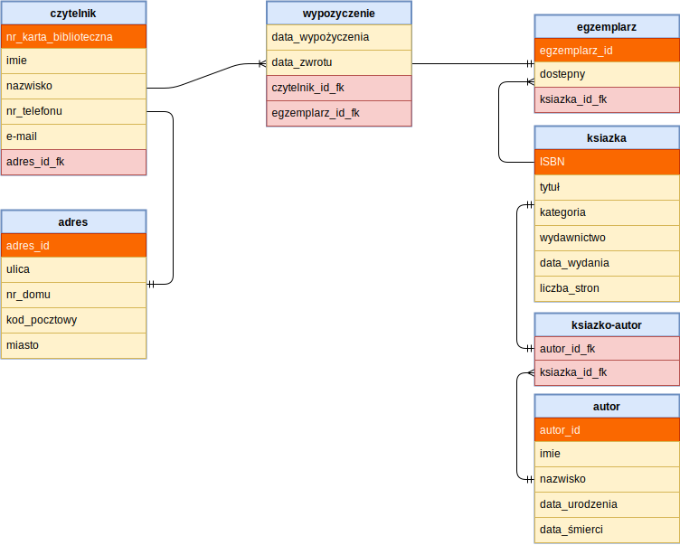

# Biblioteka
Projekt bazy danych biblioteki umożliwiający rejestrację czytelników, dodawanie zbiorów i wypożyczeń oraz zarządzanie tymi danymi.

| Nazwisko i imię  | Wydział | Kierunek | Semestr | Grupa | Rok akademicki |
| :--------------: | :-----: | :------: | :-----: | :---: | :------------: |
| Błoniarz Patryk  | WIMiIP  | IS       |    4    |   4   | 2019/2020      |
| Zieja Bartłomiej | WIMiIP  | IS       |    4    |   4   | 2019/2020      |

## Projekt bazy danych


Przykładowe zapytania tworzące tabele:
```mysql
CREATE TABLE `adres` (
  `adres_id` int(11) NOT NULL,
  `ulica` varchar(30) COLLATE utf8mb4_polish_ci NOT NULL,
  `nr_domu` int(11) NOT NULL,
  `kod_pocztowy` int(11) NOT NULL,
  `miasto` varchar(30) COLLATE utf8mb4_polish_ci NOT NULL
) ENGINE=InnoDB DEFAULT CHARSET=utf8mb4 COLLATE=utf8mb4_polish_ci;


CREATE TABLE `czytelnik` (
  `nr_karta_biblioteczna` int(11) NOT NULL,
  `imie` varchar(30) COLLATE utf8mb4_polish_ci NOT NULL,
  `nazwisko` varchar(30) COLLATE utf8mb4_polish_ci NOT NULL,
  `nr_telefonu` int(20) NOT NULL,
  `e_mail` varchar(30) COLLATE utf8mb4_polish_ci NOT NULL,
  `adres_id_fk` int(11) NOT NULL
) ENGINE=InnoDB DEFAULT CHARSET=utf8mb4 COLLATE=utf8mb4_polish_ci;
```

## Implementacja zapytań SQL
Funkcjonalności bazy danych:

1. Dodawanie nowego czytelnika wraz z adresem. Z uwagi na budowę bazy najpierw dodawany jest adres użytkownika, a potem jego klucz główny (tabeli adres) jest przekazywany do zapytania tworzącego użytkownika.
```mysql
INSERT INTO adres( ulica, nr_domu, kod_pocztowy, miasto) VALUES ('ULICA', NR_DOMU, KOD_POCZTOWY, 'MIASTO')
INSERT INTO czytelnik( imie, nazwisko, nr_telefonu, e_mail, adres_id_fk) VALUES ('Jan', 'Kowalski', 123456789, 'jkowalski@gmail.com', (SELECT MAX(adres_id) FROM adres));
```

2. Edycja danych czytelnika i jego adresu na podstawie numeru karty bibliotecznej.
```mysql
UPDATE czytelnik, adres
SET imie = 'INPUT_IMIE', nazwisko = 'INPUT_NAZWISKO', nr_telefonu = INPUT_TELEFON, e_mail = 'INPUT_MAIL', adres.ulica = 'INPUT_ULICA', adres.nr_domu = INPUT_NR_DOMU, adres.kod_pocztowy = KOD_POCZTOWY, adres.miasto = 'MIASTO'
WHERE czytelnik.adres_id_fk = adres.adres_id AND czytelnik.nr_karta_biblioteczna = nr_karty
```

3. Sprawdzenie ile wypożczeń jest przypisanych do konta czytelnika.
```mysql
SELECT COUNT(wypozyczenie.egzemplarz_id_fk) 
FROM wypozyczenie 
INNER JOIN czytelnik
ON wypozyczenie.czytelnk_id_fk = czytelnik.nr_karta_biblioteczna 
WHERE czytelnik.nr_karta_biblioteczna
```

4. Usuwanie czytelnika i związanego z nim adresu.
```mysql
DELETE czytelnik, adres 
FROM czytelnik 
INNER JOIN adres 
ON czytelnik.adres_id_fk = adres.adres_id
WHERE czytelnik.nr_karta_biblioteczna = NR_KARTY
```
5. Dodawanie książki do bazy.
```mysql
INSERT INTO ksiazka(ISBN, tytul, kategoria, wydawnictwo, data_wydania, liczba_stron)
VALUES (INPUT_ISBN, 'INPUT_TYTUL', 'INPUT_KATEGORIA', 'INPUT_WYDAWNICTWO', INPUT_DATA_WYDANIA, INPUT_LICZBA_STRON)
```

6. Dodawanie autora do bazy.
```mysql
INSERT INTO autor(imie, nazwisko, data_urodzenia, data_smierci)
VALUES ('INPUT_IMIE', 'INPUT_NAZWISKO', INPUT_DATA_URODZENIA, INPUT_DATA_SMIERCI)
```

7. Dodawanie fizycznych egzemplarzy książek (które będzie można wypożyczać).
```mysql
INSERT INTO egzemplarz(ksiazka_id_fk, dostepny) 
VALUES(INPUT_ID_KSIAZKI, true)
```

8. Sprawdzanie dostępności wolnych egzemplarzy danej książki poprzez wybranie najmniejszego id wolnego egzemplarza (jeśli istnieje wolny egzemplarz).
```mysql
SELECT egzemplarz.egzemplarz_id FROM egzemplarz 
INNER JOIN ksiazka
ON egzemplarz.ksiazka_id_fk = ksiazka.ISBN 
WHERE egzemplarz.dostepny = true AND ksiazka.ISBN = tytul_id
ORDER BY egzemplarz.egzemplarz_id
LIMIT 1
```

9. Wypożyczanie egzemplarza książki przez czytelnika.
```mysql
INSERT INTO wypozyczenie(data_wypozyczenia, data_zwrotu, czytelnk_id_fk, egzemplarz_id_fk)
VALUES(DATA_WYPOZYCZENIA, DATA_ODDANIA, ID_CZYTELNIKA, ID_EGZEMPLARZ);

UPDATE egzemplarz SET dostepny = false 
WHERE egzemplarz.egzemplarz_id =ID_EGZEMPLARZ;
```

10. Sprawdzawdzanie wszystkich wypozyczeń lub ich wyszukiwanie po nazwisku lub numerze karty bibliotecznej czytelnika albo tytule wypożyczonej książki. 
```mysql
SELECT czytelnik.nr_karta_biblioteczna as 'Numer Karty Bibliotecznej', czytelnik.imie as 'Imie', czytelnik.nazwisko as 'Nazwisko', ksiazka.tytul as 'Tytuł', egzemplarz.egzemplarz_id, wypozyczenie.data_wypozyczenia as 'Data wypożyczenia', wypozyczenie.data_zwrotu as 'Data zwrotu'
FROM wypozyczenie 
INNER JOIN czytelnik 
ON czytelnik.nr_karta_biblioteczna = wypozyczenie.czytelnk_id_fk
INNER JOIN egzemplarz 
ON egzemplarz.egzemplarz_id = wypozyczenie.egzemplarz_id_fk
INNER JOIN ksiazka 
ON ksiazka.ISBN = egzemplarz.ksiazka_id_fk
WHERE czytelnik.nazwisko LIKE "%%" AND ksiazka.tytul LIKE "%%" AND czytelnik.nr_karta_biblioteczna = NR_KARTY_BIBLIOTECZNEJ
```

11. Sprawdzanie wszystkich przetrzymań lub ich wyszukiwanie po nazwisku lub numerze karty bibliotecznej czytelnika albo tytule wypożyczonej książki.
```mysql
SELECT czytelnik.nr_karta_biblioteczna as 'Numer Karty Bibliotecznej', czytelnik.imie as 'Imie', czytelnik.nazwisko as 'Nazwisko', ksiazka.tytul as 'Tytuł', egzemplarz.egzemplarz_id, wypozyczenie.data_wypozyczenia as 'Data wypożyczenia', wypozyczenie.data_zwrotu as 'Data zwrotu'
FROM wypozyczenie 
INNER JOIN czytelnik 
ON czytelnik.nr_karta_biblioteczna = wypozyczenie.czytelnk_id_fk
INNER JOIN egzemplarz 
ON egzemplarz.egzemplarz_id = wypozyczenie.egzemplarz_id_fk
INNER JOIN ksiazka 
ON ksiazka.ISBN = egzemplarz.ksiazka_id_fk
WHERE czytelnik.nazwisko LIKE "%%" AND ksiazka.tytul LIKE "%%" AND czytelnik.nr_karta_biblioteczna = NR_KARTY_BIBLIOTECZNEJ AND CURDATE() > wypozyczenie.data_zwrotu
```

12. Zwrot wypożyczonych książek.
```mysql
DELETE FROM wypozyczenie
WHERE wypozyczenie.czytelnk_id_fk = ID_CZYTELNIKA AND wypozyczenie.egzemplarz_id_fk = ID_EGZEMPLARZ;

UPDATE egzemplarz SET dostepny = true WHERE egzemplarz.egzemplarz_id = ID_EGZEMPLARZ;
```

13. Przeszukiwanie listy czytelników względem imienia lub nazwiska lub numeru karty blibliotecznej w porządku alfabetycznym wg nazwisk.
```mysql
SELECT czytelnik.nazwisko as 'Nazwisko', czytelnik.imie as 'Imie' czytelnik.nr_karta_biblioteczna as 'Numer Karty Bibliotecznej', czytelnik.nr_telefonu as 'Numer telefonu', czytelnik.e_mail as 'e-mail' , adres.ulica as 'Ulica', adres.nr_domu as 'Numer domu', adres.kod_pocztowy as 'Kod pocztowy', adres.miasto as 'Miasto', czytelnik.adres_id_fk 
FROM czytelnik
INNER JOIN adres 
ON czytelnik.adres_id_fk = adres.adres_id
WHERE czytelnik.nazwisko LIKE "%%" AND czytelnik.imie LIKE "%%" AND czytelnik.nr_karta_biblioteczna = NR_KARTY_BIBLIOTECZNEJ
ORDER BY czytelnik.nazwisko;
```

14. Przeszukiwanie listy książek po ich tytule lub kategorii lub nazwisku autora. Lista zawiera dodatkowo informacje o liczbie dostępnych wolnych egzemplarzy danej ksiązki.
```mysql
SELECT ksiazka.tytul as 'Tytuł', autor.nazwisko as 'Nazwisko', autor.imie as 'Imie', ksiazka.kategoria as 'Kategoria', ksiazka.wydawnictwo as 'Wydawnictwo', ksiazka.ISBN as 'Numer ISBN', ksiazka.data_wydania as 'Data wydania', ksiazka.liczba_stron as 'Liczba stron', COUNT(egzemplarz.egzemplarz_id) as 'Ilość dostępnych egzemplarzy' 
FROM ksiazka 
INNER JOIN ksiazko_autor 
ON ksiazka.ISBN = ksiazko_autor.ksiazka_id_fk
INNER JOIN autor 
ON autor.autor_id = ksiazko_autor.autor_id_fk
LEFT JOIN egzemplarz 
ON egzemplarz.ksiazka_id_fk = ksiazka.ISBN AND egzemplarz.dostepny = true
WHERE ksiazka.tytul LIKE "%%" AND autor.nazwisko LIKE "%%" AND ksiazka.kategoria LIKE "%%" 
GROUP BY ksiazka.ISBN"
```

## Aplikacja
Tutaj należy opisać aplikację, która wykorzystuje zapytania SQL z poprzedniego kroku. Można, jednak nie jest to konieczne, wrzucić tutaj istotne snippety z Waszych aplikacji.

## Dodatkowe uwagi
Baza została stworzona przy pomocy phpMyAdmin.
